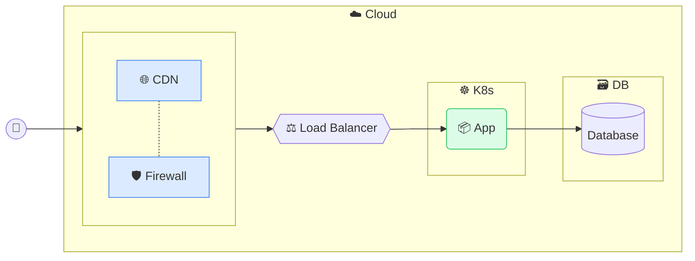

# Architecture Diagram Skill

## Steps

1. **Understand the system** — Identify all components from the argument or conversation context. Ask clarifying questions if the topology is ambiguous.

2. **Classify components** — Map each component to a semantic class from the Reference section below (`edge`, `proxy`, `cache`, `compute`, `database`, `storage`). Use only the classes relevant to the diagram; omit unused `classDef` lines.

3. **Group into subgraphs** — Identify logical boundaries (cloud provider, data center, cluster, VM, server). Use the subgraph naming patterns from the Reference section.

4. **Output the full Mermaid block** — Produce a fenced `mermaid` code block starting with the mandatory `%%{init}` header (copied verbatim from the Reference section), followed by `flowchart LR`, `classDef` declarations, subgraphs, nodes, connections, and `class` assignments at the end.

5. **List design decisions** — After the diagram, briefly explain non-obvious choices (e.g., why a component was classified as `cache` vs `proxy`, why two nodes share a subgraph).

## Hard Rules

- Always start with `flowchart LR`.
- Always copy the `%%{init}` header verbatim — never modify it.
- Always place `class` assignments at the end of the diagram.
- Use `&` for multi-target connections (e.g., `lb --> svc1 & svc2 & svc3`).
- Use `-.-` for logical/association links (no traffic flow); use `-.->` for labeled dashed arrows.

---

## Reference

### Mandatory `%%{init}` Header

Copy this block verbatim at the top of every diagram. Never modify it.

```
%%{init: {
  'theme': 'base',
  'themeVariables': {
    'primaryColor': '#d6d3d1',
    'primaryTextColor': '#292524',
    'primaryBorderColor': '#78716c',
    'lineColor': '#a8a29e',
    'secondaryColor': '#f5f5f4',
    'tertiaryColor': '#fafaf9',
    'fontFamily': 'Open Sans, Arial, Ubuntu, sans-serif'
  },
  'themeCSS': '.node rect, .node polygon, .node circle, .node ellipse, .node path { filter: drop-shadow(3px 3px 4px rgba(0, 0, 0, 0.2)); } .cluster rect { filter: drop-shadow(4px 4px 6px rgba(0, 0, 0, 0.15)); }'
}}%%
```

### Semantic Node Classes

Declare only the classes you actually use. Place all `classDef` lines immediately after `flowchart LR`.

| Class      | Fill      | Stroke    | Role                                        |
|------------|-----------|-----------|---------------------------------------------|
| `edge`     | `#dbeafe` | `#3b82f6` | CDN, firewall, DDoS protection, edge layer  |
| `proxy`    | `#e0f2fe` | `#0ea5e9` | Reverse proxy, load balancer, API gateway   |
| `cache`    | `#fce7f3` | `#ec4899` | HTTP cache, in-memory cache (Varnish, Redis) |
| `compute`  | `#dcfce7` | `#22c55e` | Application containers, VMs, functions      |
| `database` | `#ede9fe` | `#8b5cf6` | Relational/NoSQL databases, primary data stores |
| `storage`  | `#fef3c7` | `#f59e0b` | File/blob storage, NFS, S3, EFS, EBS        |

```
classDef edge fill:#dbeafe,stroke:#3b82f6
classDef proxy fill:#e0f2fe,stroke:#0ea5e9
classDef cache fill:#fce7f3,stroke:#ec4899
classDef compute fill:#dcfce7,stroke:#22c55e
classDef database fill:#ede9fe,stroke:#8b5cf6
classDef storage fill:#fef3c7,stroke:#f59e0b
```

### Node Shapes

| Shape         | Syntax             | Use for                                |
|---------------|--------------------|----------------------------------------|
| Double circle | `id(("label"))`    | End user / external actor              |
| Rectangle     | `id["label"]`      | Managed cloud service                  |
| Hexagon       | `id{{"label"}}`    | Proxy, load balancer, cache            |
| Rounded rect  | `id("label")`      | Container, application, function       |
| Cylinder      | `id[("label")]`    | Database, persistent storage volume    |

### Emoji by Infrastructure Type

| Emoji | Infrastructure type                      |
|-------|------------------------------------------|
| 👤    | End user                                 |
| ☁️    | Cloud provider (AWS, GCP, Azure…)        |
| 🏬    | On-premises data center / organization   |
| ☸️    | Kubernetes cluster (K8s, EKS, GKE…)     |
| 🖥️    | Physical or virtual server / VM          |
| 📦    | Container / application                  |
| 🌐    | CDN / global edge network                |
| 🛡️    | Security layer (WAF, firewall, DDoS)     |
| ⚖️    | Load balancer                            |
| 🗃️    | Managed database service                 |
| 💾    | File / object storage service            |

### Subgraph Naming Patterns

```
subgraph aws["☁️ AWS"]
subgraph cloud["☁️ GCP"]
subgraph dc["🏬 Data Center"]
subgraph edge[" "]          ← blank label: used for the edge/security group
subgraph k8s["☸️ K8s"]
subgraph vm["🖥️ server-name"]
subgraph db_svc["🗃️ DB"]
subgraph files["💾 Storage"]
```

The edge subgraph uses a blank label (`" "`) because Mermaid renders the subgraph ID (`edge`) as the visible title otherwise.

### Connection Types

| Syntax                   | Meaning                        |
|--------------------------|--------------------------------|
| `a --> b`                | Traffic / data flow            |
| `a -.- b`                | Logical association (no flow)  |
| `a -. "label" .-> b`     | Labeled dashed arrow           |
| `a --> b & c & d`        | One source, multiple targets   |

### Diagram Structure Template


